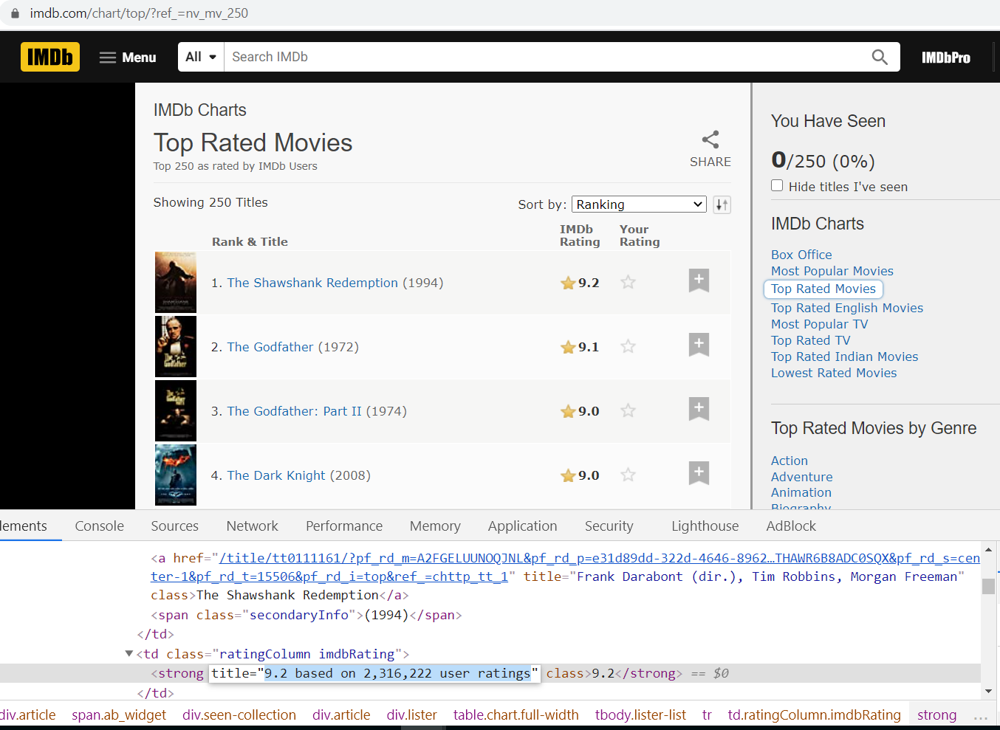

## Introduction

This is the Final Project for `Web Scraping with R` course. As a source, I used [IMDb](https://www.imdb.com/) website. IMDb^[Internet Movie Database] is an online database of information related to movies and ratings. I scraped the webpage of [Top 250 movies](https://www.imdb.com/chart/top/). Code can be found [here](https://github.com/abdu95/web_scraping_R_final)

## Scrape the page
Here we can see the screenshot from the webpage.


In the webpage, we can see the **title** of the movie, its released **year**, its **rating**, and **link** to the movie. If we inspect the page, we also can see **cast** of the movie given in the movie title and **votes** given in the movie rating element. 

Before continuing, I would ask the reader to read **Side note** section before getting familiar with the code.

I scraped the webpage and built a dataframe that contains such variables as 'movie_title', 'year', 'rating', 'votes', 'cast', 'link'. 


```{r, echo = FALSE, warning=FALSE, message=FALSE}
library(rvest)
library(data.table)
library(jsonlite)
library(ggplot2)
library(knitr)

url <- 'https://www.imdb.com/chart/top'
# read url
file_html <- read_html(url)
# write_html(file_html, 'html_file.html')

# assign data from titleColumn for reusability
boxes <- file_html %>% 
  html_nodes('.titleColumn a')

# get movie names
movie_names <- html_text(boxes)

# get movie ratings
ratings <- as.numeric(
  file_html %>%  
  html_nodes('strong') %>% 
  html_text())

# get movie released year
years_p <- 
  file_html %>%  
  html_nodes('.secondaryInfo') %>% 
  html_text()

# remove brackets ()
years <- as.numeric(sub("\\).*", "", sub(".*\\(", "", years_p))) 

# get link of the movie 
links_p <- 
  boxes %>% 
  html_attr('href')

# remove unnecessary characters that comes after '?'
links_c <- gsub("\\?.*", "", links_p)

links <- c()

# build full link
for(x in links_c) {
  links <- c(links, paste0('https://www.imdb.com', x)) 
}

# get actors of the movie
actors <- 
  boxes %>% 
  html_attr('title')

# get votes
votes_p <- file_html %>% 
  html_nodes('.imdbRating') %>% 
  html_node('strong') %>% 
  html_attr('title')

# extract only numbers (as a string) from full string
votes_s <- c()
for (x in votes_p) {
  votes_s <- c(votes_s, gsub(',','',
                             gsub(' user ratings','',
                                  gsub('.*?based on ','',
                                       x))))
}

votes <- c()

# convert string into numeric
for (x in votes_s) {
  votes <- c(votes, as.numeric(x))
}
# create a dataframe for markdown. votes as string
df_to_show <- data.frame('movie_title' = movie_names, 
                 'year' = years, 
                 'rating' = ratings,
                 'votes' = votes_s,
                 'cast' = actors, 
                 'link' = links)  

# create a dataframe for further analysis. votes as numeric
df <- data.frame('movie_title' = movie_names, 
                 'year' = years, 
                 'rating' = ratings,
                 'votes' = votes,
                 'cast' = actors, 
                 'link' = links)


```

```{r, echo = FALSE, warning=FALSE, message=FALSE}
knitr::kable(df_to_show[1:4,1:6], caption = "Dataframe", floating.environment="sidewaystable")

```

## First EDA: years

This statistics shows that the oldest movie (min) is taken in 1921, and youngest is in 2020 (max). In this list, movies that are released in 84 different years are given.

```{r, echo = FALSE, warning=FALSE, message=FALSE}
kable(as.array(summary(years)), caption = "Summary statistics for years movie released")
```


```{r, echo = FALSE, warning=FALSE, message=FALSE}
uniques <- unique(years)

qplot(years, 
      geom="histogram", 
      binwidth = 1,
      xlim=c(1921,2020)) 
most_appeared_years <- table(years)

```

Most of the movies in the list are released in **1995** (8) movies, in **2019** (7 movies) and in **1957** (6 movies)  


## Second EDA: ratings

```{r, echo = FALSE, warning=FALSE, message=FALSE}
kable(as.array(summary(ratings)), caption = "Summary statistics of ratings")
```

The minimum rating that is given to movie is 8.0 and the maximum rating that is given to movie is 9.2

```{r, echo = FALSE, warning=FALSE, message=FALSE}

hist(
  ratings,
  col = 'skyblue3')
```

Histogram of ratings has long right tail. Most of the (more than 100) movies got rating between 8.0 and 8.1. Few number of movies got rating between 8.6 and 9.2


# Third EDA: votes

```{r, echo = FALSE, warning=FALSE, message=FALSE}
kable(as.array(summary(votes)), caption = "Summary statistics of votes")
```

```{r, echo = FALSE, warning=FALSE, message=FALSE}

hist(
  votes,
  col = 'skyblue3')
```

Histogram of votes is also skewed to right. Most of the movies obtained votes between 0 and 500000. Only few number of movies obtained more than one and half million votes 

## Budget analysis

As a next step, I analyzed the budget and revenue of the movies. Below, the extraction from the dataframe is shown.

``````{r, echo = FALSE, warning=FALSE, message=FALSE}
library(stringr)

# a function which downloads information from the website to dataframe
get_movies <- function(arg_url) {
  
  # to get a web page, pass URL to read_html 
  url_current <- arg_url
  movie_file <- read_html(url_current)

  # get JSON data
  json_data <-
    fromJSON(movie_file %>%
               html_nodes(xpath = "//script[@type='application/ld+json']") %>%
               html_text())
  
  # get movie title from JSON
  movie_title <- json_data$name
  # genre <- json_data$genre
  
  # get movie genre
  genre <- 
    movie_file %>% 
    html_nodes('.txt-block~ .canwrap') %>% 
    html_text()
  
  # remove word 'Genres'
  genre_s <- sub('.*Genres\\:', '', genre)
  
  # remove empty spaces, pipe | character, and line break "\n"
  genre <-  gsub("\\s", "",
                 gsub(' ', '',
                      gsub('[|]', ',',
                           str_remove_all(genre_s, "\n"))))
  
  # we need text blocks to get budget and revenue of the movie
  text_blocks <- 
    movie_file %>% 
    html_nodes('.txt-block') %>% 
    html_text(trim = T)
  
  # among all text blocks, find the one that contains the word "Cumulative"
  search_gross <- "Cumulative"
  # find its position
  show_r_position <- match(1, str_detect(text_blocks, search_gross))
  # get text in that position
  revenue_p <- text_blocks[show_r_position]
  
  # extract revenue of movie from textblock, remove comma, convert to numeric 
  revenue <- as.numeric(gsub(",","",substr(revenue_p, 30, nchar(revenue_p))))
  
  # among all text blocks, find the one that contains the word "Budget"
  search_budget <- "Budget"
  # find its position
  show_b_position <- match(1, str_detect(text_blocks, search_budget))
  # get text in that position
  budget_p <- text_blocks[show_b_position]
  # remove colon, remove dollar sign
  budget_s <- gsub("\\:*","",
                   gsub("\\(.*$", "", budget_p))
  
  # remove word "Budget", remove spaces, remove commas, convert to numeric
  budget <- as.numeric(gsub(',','', trimws(sub('.*Budget\\$', '', budget_s))))
  
  # build a dataframe
  df_b_r <-  data.frame(movie_title, genre, revenue, budget)
  
  return(df_b_r)
}

some_links <- df[1:5,6] 
# apply the function to 5 links, save as a list
movies_list <- lapply(some_links, get_movies)

# convert list to dataframe to show in markdown
movies_df <- rbindlist(movies_list)
knitr::kable(movies_df[1:4,1:4], caption = "Dataframe", floating.environment="sidewaystable")

```

Scatterplot shows that there is a positive correlation between the budget (expenditure) and revenue (earned money) of the movies. But we can not conclude that all movies that spent high amount of money earned high. This is the case only for a number of movies. Most of the movies earned the equal amount of money as its budget or even earned less money than the budget of the movie.
```{r, echo = FALSE, warning=FALSE, message=FALSE}
get_revenue_budget <- function(arg_url) {
  
  # to get a web page, pass URL to read_html 
  url_current <- arg_url
  movie_file <- read_html(url_current)
  
  json_data <-
    fromJSON(movie_file %>%
               html_nodes(xpath = "//script[@type='application/ld+json']") %>%
               html_text())
  
  movie_title <- json_data$name

  text_blocks <- 
    movie_file %>% 
    html_nodes('.txt-block') %>% 
    html_text(trim = T)
  
  search_gross <- "Cumulative"
  show_r_position <- match(1, str_detect(text_blocks, search_gross))
  revenue_p <- text_blocks[show_r_position]
  revenue <- as.numeric(gsub(",","",substr(revenue_p, 30, nchar(revenue_p))))
  
  search_budget <- "Budget"
  show_b_position <- match(1, str_detect(text_blocks, search_budget))
  budget_p <- text_blocks[show_b_position]
  budget_s <- gsub("\\:*","",
                   gsub("\\(.*$", "", budget_p))
  
  budget <- as.numeric(gsub(',','', trimws(sub('.*Budget\\$', '', budget_s))))
  
  
  df_b_r <-  data.frame(movie_title, revenue, budget)
  
  return(df_b_r)
}


movies_list <- lapply(df$link, get_revenue_budget)
movies_df <- rbindlist(movies_list)

# remove rows with missing values
final_df <- movies_df[complete.cases(movies_df),]

ggplot(final_df, aes(x=budget, y=revenue)) + geom_point(color="blue") +
  labs(y="Revenue", x = "Budget") +
  ggtitle("Budget and revenue of movie") + 
  geom_smooth(method=lm)

```

This plot shows the movies with the highest revenue. **Avengers: Endgame**, **Avengers: Infinity War** and **Harry Potter and the Deathly Hallows: Part 2** are the top "Movies with highest revenue"
```{r, echo = FALSE, warning=FALSE, message=FALSE}
library(dplyr)

# top 10 rows with highest revenue
top_movies <- final_df %>% slice_max(revenue, n = 10)

ggplot(top_movies, aes(x=movie_title, y=revenue)) + geom_point(color="blue") +
  labs(y="Revenue", x = "Movie title") +
  ggtitle("Movies with highest revenue") +
  scale_x_discrete(guide = guide_axis(angle = 90)) +
  NULL

```

## Summary

In this assignment I scraped the webpage of Top 250 movies in IMDb and tried to analyze them. During the process, I faced several challenges. I had to understand the hierarchy of the webpage in order to extract the necessary element from it. The data was in text format and I had to clean it, extract number from it and convert it to suitable format. However, I am glad that I gained sufficient amount of knowledge throughout the process including extracting data from web, working with functions, building a dataframe from the obtained data. 

By analyzing this data, I found out that movies with highest revenue does not necessarily achieve highest rating in this website. This means for users, how much money directors spend for the movie is not the number one factor to determine its quality. The movies with deep philosophical meaning and best acting have been more appreciated by the users, as it is the case for the top rated movie **The Shawshank Redemption**. 


## Side note: 
It takes 1.5 seconds to obtain data from one webpage. Since the code is obtaining data from 250 webpages, it took 7-8 minutes to compile the code fully and achieve the result. Therefore, if you want to execute R code or compile R markdown, I would ask you to be patient and wait 7-8 minutes to see the end result.